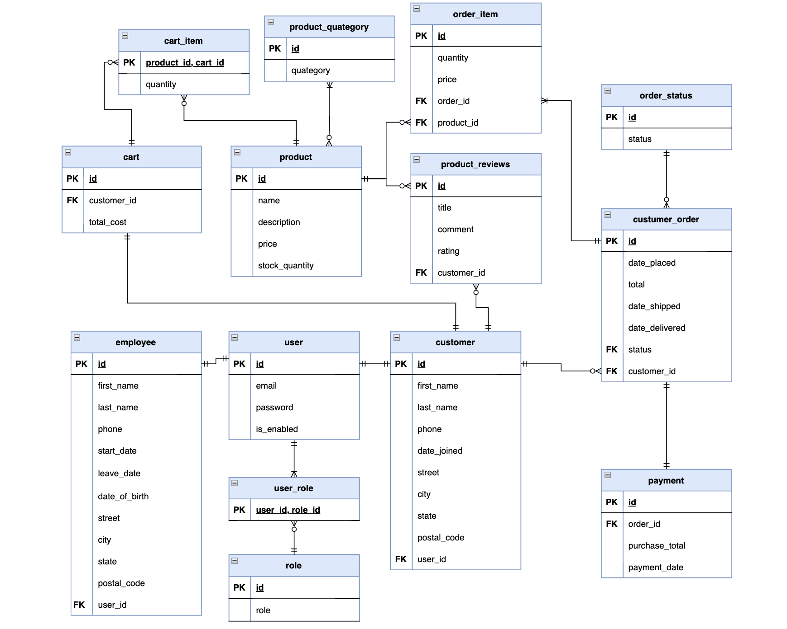

# Fullstack Ecommerce Application

Welcome to the Awesome Ecommerce Application!

## Development Process

Developed the application following best practices to ensure high quality code and functionality across the different application layers.
To adhere to industry standards and best practices, I decided to follow a **test-driven development** approach, creating **unit**,
**integration**, and **end-to-end tests**. My goal was to achieve a high test coverage percentage without sacrificing in code quality.
Below is a list of further development approaches I took and the reason behind them.

- **DTO Implementation:** Application makes use of data transfer objects to separate client data from business data and prevent exposure of sensitive data.
- **Custom Exception Handling:** @RestControllerAdvice is used to handle all application exceptions and provide the client consistent responses.
  - [Reflectoring.io - Exception Handling Techniques](https://reflectoring.io/spring-boot-exception-handling/)
- **Automated DTO Conversion:** Used Mapstruct to automate conversion from DTOs to business objects and vice versa. All conversions were tested.
- **Object Mother Design Pattern:** Implemented this pattern to get pre-defined objects to use in tests, have consistent objects across tests, reduce code for creation of objects in tests,
    and ensure that every test runs with fresh data.
  - [Reflectoring.io - Object Mother](https://reflectoring.io/objectmother-fluent-builder/)
  - [java-design-patterns.com - Object Mother](https://java-design-patterns.com/patterns/object-mother/)

## Features

- Browse Products: Customers can explore a wide range of products with detailed descriptions and images.
- Shopping Cart: Customers can add products to their shopping cart and manage quantities.
- Secure Checkout: Seamless and secure payment processing using the Stripe payment gateway.
- Order History: Customers can view their order history and track the status of their deliveries.
- Account Activation: Customer accounts are created but remain inactive until they activate via an email verification link.
- User Roles: The application supports Customer, Employee and Admin roles.
    - Employees: Manage customer orders, update product inventory, and handle customer support.
    - Admins: Have all the capabilities of employees plus the ability to manage employees.

## Technologies Used

- Backend Application:
    - Java
    - Spring Boot
    - Spring Security
    - Spring Data JPA
    - PostgreSQL
    - Flyway
    - Stripe Payments API
    - Docker
    - MapStruct
- Backend Testing
  - Mockito
  - JUnit 5
  - AssertJ
  - Selenide
  - TestContainers
- Frontend:
    - React JS
    - TypeScript

## Application Database ER Diagram

## Getting Started

To run the application locally, follow these steps:

1. Clone the repository: `https://github.com/stay-fcsd/fullstack-ecommerce-store`

2. Set up the backend:

    - Install Java 17.

    - Maven is optional as the repository includes the maven wrapper

    - Set up needed dependencies like PostgreSQL by running `docker-compose up` in the base directory.

    - Build and run the Spring Boot application: `mvn spring-boot:run`

3. Set up the frontend:

    - Install Node.js and npm.

    - Navigate to the frontend directory: `cd frontend`

    - Install dependencies: `npm install`

    - Start the frontend development server: `npm run dev`
